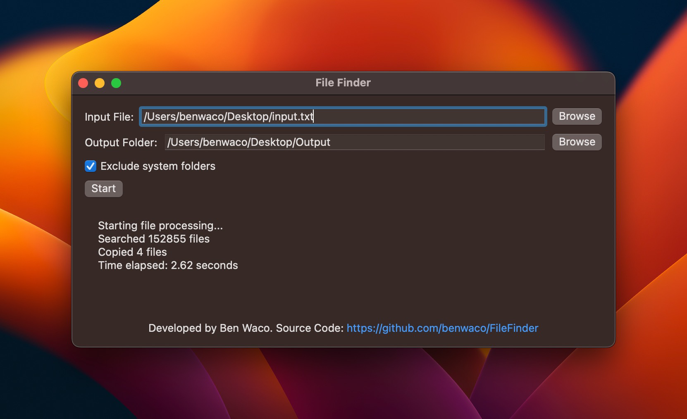

# FileFinder

FileFinder is a macOS application that allows you to search for and copy specific files from your computer based on a list of file names provided in a text file. This tool is especially useful when you need to find and gather files with specific names scattered throughout your computer.



## Features

- Search for files based on a list of file names provided in a text file
- Exclude system folders during the search to speed up the process
- Concurrently search multiple directories to improve performance
- Copy the found files to a specified output folder
- Display search progress and results in a console

## Installation

To use FileFinder, you can either clone the repository and build the application using Xcode, or download the latest pre-built release.

### Clone and build

1. Clone the repository:

```
git clone https://github.com/benwaco/FileFinder.git
```

2. Open the project in Xcode and build it:

```
open FileFinder.xcodeproj
```


3. Run the application on your macOS device.

### Download pre-built release

1. Go to the [releases](https://github.com/benwaco/FileFinder/releases) page.
2. Download the latest release's `.zip` file.
3. Extract the `.zip` file and move the `FileFinder.app` to your Applications folder.

## Usage

1. Open FileFinder.
2. Click on "Browse" next to "Input File" and select the text file containing the list of file names you want to search for. The file names should be one per line.
3. Click on "Browse" next to "Output Folder" and select the folder where you want to copy the found files.
4. Optionally, check the "Exclude system folders" checkbox if you want to skip searching within system folders.
5. Click on "Start" to begin the search and copying process. The console will display the progress and results.

## Contributing

Contributions are welcome! If you have any ideas, suggestions, or bug reports, please feel free to open an issue or submit a pull request.

## License

FileFinder is released under the BSD 3-Clause License. See [LICENSE](LICENSE) for more information.

## Credits

FileFinder is developed by Ben Waco.
